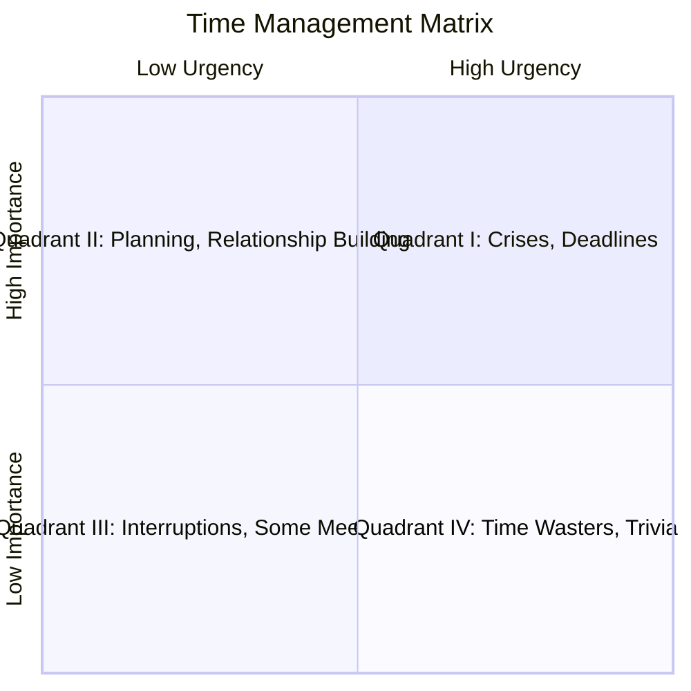
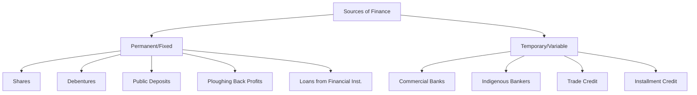

# ENTP CIE-II Questions and Answers

---

### 1. Define Analysis of market demand
[cite_start]Market and demand analysis involves a detailed study of various market segments in terms of customer preferences, competitors, the untapped demand, and prevalent trade practices[cite: 4]. [cite_start]It aims to calculate the aggregated demand for a particular product or service and understand how a firm's abilities can synchronize with market requirements[cite: 4].

---

### 2. Define Feasibility of Study
[cite_start]Feasibility analysis (or feasibility study) is used to assess the strengths and weaknesses of a proposed project and present directions of activities to improve a project and achieve desired results[cite: 4]. [cite_start]It assesses technical resources, economic viability, legal requirements, operational needs, and scheduling estimations[cite: 4].

---

### 3. List any two components of tax burden in a project
1.  [cite_start]**Direct Taxes:** Such as Income Tax, Corporate Tax, or Capital Gains Tax[cite: 3].
2.  [cite_start]**Indirect Taxes:** Such as GST on goods and inputs, Customs duty on imported machinery, or Excise duty[cite: 3].

---

### 4. List any Three Activities involved in construction phase.
1.  [cite_start]**Site Preparation:** Clearing land, arranging utilities, and ensuring safety measures[cite: 3].
2.  [cite_start]**Resource Mobilization:** Arranging materials, labour, equipment, and contractors[cite: 3].
3.  [cite_start]**Scheduling Work:** Following time plans, milestones, and daily progress plans[cite: 3].

---

### 5. Define Procrastination
*Note: While "procrastination" is mentioned in the context of time management benefits (minimizing it), a specific definition is not provided in the text. Based on general knowledge:*
Procrastination is the act of delaying or postponing tasks, often habitually, despite knowing there may be negative consequences. [cite_start]Effective time management helps minimize procrastination by creating action plans and to-do lists[cite: 2].

---

### 6. Explain Behavioral aspects of Entrepreneurial.
[cite_start]Entrepreneurial behavior is driven by a sense of self-discovery and independence, focusing on organizational performance and goal achievement[cite: 2]. [cite_start]Key aspects include taking responsibility for one's own feelings and responses, and understanding human behavior through cognition, affection, and conation[cite: 2]. [cite_start]Additionally, personality traits, interests, attitudes, and emotions play a crucial role in how entrepreneurs perceive and interact with their environment[cite: 2].

---

### 7. Define the Project Finance.
[cite_start]Project finance is the financing of long-term infrastructure, industrial projects, and public services based on a non-resource or limited resource financial structure[cite: 4]. [cite_start]It is a loan structure that relies primarily on the project cash flow for repayments, with the project assets, rights, and interests held as security[cite: 4].

---

### 8. What is market and demand Analysis.
[cite_start]Market and demand analysis is a process carried out to evaluate a project idea by studying market needs, consumer preferences, and calculating aggregated demand[cite: 4]. [cite_start]It involves steps such as situational analysis, data collection, market surveys, market description, demand forecasting, and market planning[cite: 4].

---

### 9. List any two components of tax burden
*Refer to Answer 3.*
1.  [cite_start]**Corporate Tax** (Direct Tax)[cite: 3].
2.  [cite_start]**GST on goods and inputs** (Indirect Tax)[cite: 3].

---

### 10. Define Resource Mobilization.
[cite_start]Resource mobilization is a key activity in the construction phase that involves arranging materials, labour, equipment, and contractors[cite: 3]. [cite_start]It ensures that the necessary resources are available to convert the project plan into physical reality[cite: 3].

---

### 11. What is Personality Determinants?
[cite_start]Personality determinants are the factors that shape and influence an individual's personality[cite: 2]. These include:
1.  [cite_start]**Biological Factors:** Heredity, brain, and physical features[cite: 2].
2.  [cite_start]**Situational Factors:** The influence of the immediate environment and specific situations[cite: 2].
3.  [cite_start]**Cultural Factors:** Beliefs, values, and attitudes common to a culture[cite: 2].
4.  [cite_start]**Family and Social Factors:** The socialization and identification processes within a family and social group[cite: 2].

---

### 12. What are Change behaviors?
[cite_start]Change behavior refers to any transformation or modification of human behavior[cite: 2]. [cite_start]Theories explaining this include **Self-efficacy** (an individual's impression of their ability to perform a task), **Learning Theories** (behavior modified through learning), and **Social Learning** (behavior determined by environmental, personal, and behavioral elements)[cite: 2].

---

### 13. Explain the Leadership style.
[cite_start]Leadership style refers to the different behaviors or actions a leader exhibits in various positions and situations[cite: 2]. The main types are:
1.  [cite_start]**Autocratic (Authoritarian):** Unilateral decision-making and centralized authority[cite: 2].
2.  [cite_start]**Democratic (Participative):** Involving the group in decision-making and delegating authority[cite: 2].
3.  [cite_start]**Laissez-Faire (Free-rein):** Giving the group complete freedom with minimal interference[cite: 2].

---

### 14. What do you mean by Technical Analysis?
[cite_start]Technical analysis is an examination used by engineering and financial experts to formulate a project by assessing its technical feasibility[cite: 4]. [cite_start]It involves evaluating aspects such as manufacturing processes, material inputs, product mix, plant capacity, location, machineries, and civil works to ensure the project can be successfully implemented[cite: 4].

---

### 15. Differentiate Technical analysis and market demand analysis.
* [cite_start]**Technical Analysis** concerns project inputs (supplies) and outputs (production) of real goods and services, defining the project framework and capacity[cite: 4].
* [cite_start]**Market Demand Analysis** focuses on the commercial aspect, analyzing the potential market size, consumer preferences, and ensuring there is effective demand at a remunerative price for the product[cite: 4].

---

### 16. What is market demand analysis.
*Refer to Answer 1 and 8.*
[cite_start]It is a detailed study of market segments to understand customer preferences and competitors, aiming to calculate aggregated demand and synchronize firm abilities with market requirements[cite: 4].

---

### 17. Write about time management.
[cite_start]Time management refers to managing time effectively so that the right time is allocated to the right activity to accomplish more in a set period[cite: 2]. [cite_start]It involves skills like prioritization (ABC method, Pareto principle), scheduling (boxing, time mapping), and execution (setting deadlines, breaking down tasks)[cite: 2]. [cite_start]Effective time management reduces stress, minimizes procrastination, and helps individuals reach their goals[cite: 2].

---

### 18. What are motivation aspects.
[cite_start]Motivation is the inner state that activates and directs behavior towards the accomplishment of a goal[cite: 2]. [cite_start]Aspects include **negative motivation** (force/fear), **positive motivation** (reward), **extrinsic motivation** (external benefits like wages), and **intrinsic motivation** (internal satisfaction)[cite: 2]. [cite_start]Theories like Maslow’s Hierarchy of Needs and McGregor’s Theory X and Y explain the drivers of motivation[cite: 2].

---

### 19. What is technical analysis
*Refer to Answer 14.*
[cite_start]Technical analysis involves examining a project's technical feasibility, including manufacturing processes, technology choice, plant capacity, location, and equipment requirements[cite: 4].

---

### 20. Differentiate technical analysis and market demand analysis.
*Refer to Answer 15.*
[cite_start]Technical analysis deals with the *how* of production (technology, equipment, location) [cite: 4][cite_start], while market demand analysis deals with the *who* and *how much* of consumption (customers, demand quantity, pricing)[cite: 4].

---

### 21. What are the types of personality determinant?
The major groups of personality determinants are:
1.  [cite_start]**Biological Factors:** Heredity, brain, and physical features[cite: 2].
2.  [cite_start]**Situational Factors:** The influence of the immediate environment[cite: 2].
3.  [cite_start]**Cultural Factors:** Beliefs, values, and attitudes common to a culture[cite: 2].
4.  [cite_start]**Family and Social Factors:** The socialization and identification processes within a family[cite: 2].
5.  [cite_start]**Other Factors:** Temperament, interest, character, schema, and motives[cite: 2].

---

### 22. Explain the elements of project organization for successful implementation
[cite_start]Project organization involves structuring roles and responsibilities to execute a project effectively[cite: 3]. Key elements include:
* [cite_start]**Structure:** Choosing between Functional, Project (Pure), or Matrix organizations[cite: 3].
* [cite_start]**Roles:** Defining the Project Manager, Functional Specialists, and Support Teams[cite: 3].
* [cite_start]**Communication:** Establishing clear reporting lines and coordination mechanisms[cite: 3].
* [cite_start]**Resource Allocation:** Organizing personnel, equipment, and materials efficiently[cite: 3].

---

### 23. Explain the various determinants of personalities in detail.
[cite_start]Personality is shaped by several interacting determinants[cite: 2]:
* [cite_start]**Biological Factors:** Includes **heredity** (transmission of qualities from ancestors), **brain** physiology, and **physical features** (height, appearance affecting self-view)[cite: 2].
* [cite_start]**Situational Factors:** The environment imposes constraints or pushes; a person may behave differently in different situations[cite: 2].
* [cite_start]**Cultural Factors:** Culture instills values regarding independence, aggression, or cooperation, expecting members to behave in set patterns[cite: 2].
* [cite_start]**Family and Social Factors:** Through **socialization** (acquiring acceptable behavior) and **identification** (emulating parents/models), family deeply impacts personality[cite: 2].
* [cite_start]**Other Factors:** Temperament, interest, character, schema, and motives also contribute[cite: 2].


*(Diagram Reference: Fig 5.2.2 "Determinants of Personality" in Ent5.pdf, Page 12)*

---

### 24. Explain Financial analysis and list out necessary technical analysis.
**Financial Analysis:**
[cite_start]Financial analysis identifies the financial strengths and weaknesses of a firm by examining items in the Balance Sheet and Income Statement[cite: 4]. [cite_start]Its objectives are to measure short-term and long-term solvency, operating efficiency, and profitability[cite: 4].

**Necessary Technical Analysis components:**
1.  [cite_start]Manufacturing process/technology[cite: 4].
2.  [cite_start]Technical arrangements[cite: 4].
3.  [cite_start]Material inputs and utilities[cite: 4].
4.  [cite_start]Product mix[cite: 4].
5.  [cite_start]Plant capacity[cite: 4].
6.  [cite_start]Location and site[cite: 4].
7.  [cite_start]Machineries and equipments[cite: 4].
8.  [cite_start]Structure and civil works[cite: 4].

---

### 25. Explain Urgency time management matrix?
[cite_start]The Time Management Matrix categorizes activities into four quadrants based on **Importance** and **Urgency**[cite: 2].
* [cite_start]**Quadrant I (Important & Urgent):** Crises, deadlines, emergencies[cite: 2].
* [cite_start]**Quadrant II (Important & Not Urgent):** Strategic planning, relationship building, personal development (Proactive Mode)[cite: 2].
* [cite_start]**Quadrant III (Urgent & Not Important):** Interruptions, emails/calls (Reactive Mode)[cite: 2].
* [cite_start]**Quadrant IV (Not Urgent & Not Important):** Time wasters, excessive TV (Disengagement Mode)[cite: 2].



*(Diagram Reference: Fig. 5.8.1 "Different Categories of Quadrants" in Ent5.pdf, Page 59)*

---

### 26. Explain Project planning CPM techniques.

The **Critical Path Method (CPM)** is a deterministic project planning technique used when activity times are known and fixed.

* 
**Process:** Identify activities, draw a network diagram, estimate fixed durations, and calculate earliest/latest start and finish times.


* 
**Critical Path:** Identifies the longest path of dependent tasks, determining the shortest possible project duration.


* 
**Focus:** Focuses on time-cost trade-offs and resource allocation.


* 
**Slack/Float:** Highlights non-critical tasks that have flexibility without delaying the project.


---

### 27. Explain PERT Techniques in detail.

The **Program Evaluation and Review Technique (PERT)** is a probabilistic method used when activity durations are uncertain, such as in R&D.

* **Three Time Estimates:**
1. 
**Optimistic time ()**.


2. 
**Most likely time ()**.


3. 
**Pessimistic time ()**.


* 
**Expected Time Formula:** 

.


* 
**Usage:** It helps in risk analysis and forecasting completion time in projects with high uncertainty.


---

### 28. Explain Time management strengths and weaknesses in detail.

**Strengths (Advantages):**

* 
**Efficiency:** More tasks are completed during the workday.


* 
**Flexibility & Reliability:** Tasks are listed and prioritized, ensuring no events are missed and reducing stress.


* 
**Focus & Confidence:** Minimizes procrastination, increases self-confidence, and ensures goals are reached.


**Weaknesses (Disadvantages):**

* 
**Non-clear Objectives:** Poor management can lead to being stuck in undefined tasks.


* 
**Mismanagement:** Over-organizing or forgetting details can lead to fatigue.


* 
**Rigidity:** Can lead to an inability to say "no," or an obsession with doing things "right" that makes life stagnant.


* 
**Overloading:** Overconfidence may lead to taking on too many tasks, causing blunders.


---

### 29. Describe in detail about attributes and models?

**Personality Attributes:**
Key attributes for an effective personality include **Attitude** (optimistic), **Enthusiasm** (intense interest), **Ethical** (moral principles), **Goal Focused**, **Listener**, **Networked**, **Persistent**, **Self-Aware**, **Self-Confident**, and **Self-Disciplined**.

**Personality Models:**

1. 
**Myers-Briggs Type Indicator (MBTI):** Uses four dichotomies (Extraversion/Introversion, Sensing/Intuition, Thinking/Feeling, Judging/Perceiving) to identify 16 personality types.


2. 
**The Big Five Model:** Identifies five dimensions: **Extroversion**, **Emotional Stability**, **Agreeableness**, **Conscientiousness**, and **Openness**.


3. 
**Physiognomy Types:** Sheldon’s model based on body type: **Endomorph**, **Mesomorph**, and **Ectomorph**.


---

### 30. Discuss the project management during construction phase.

This phase involves converting the project plan into physical reality.

* 
**Key Activities:** **Site Preparation** (clearing land), **Resource Mobilization** (arranging labor/materials), **Scheduling** (following milestones), **Quality Control** (testing materials), **Cost Control** (monitoring expenses), and **Risk/Safety Management**.


* 
**Coordination & Reporting:** Involves regular meetings, daily progress logs, and managing changes/stakeholder expectations.


* 
**Objective:** To avoid delays and cost overruns while ensuring smooth execution.


---

### 31. What are strengths? Explain motivation aspects in details.

**Strengths:** In the context of leadership, strengths include critical thinking, creative thinking, listening, motivating others, and networking.

**Motivation Aspects:**
Motivation is the willingness to exert effort towards a goal.

* **Types:**
* 
**Negative:** Based on force or fear (e.g., threat of dismissal).


* 
**Positive:** Based on reward and gain.


* 
**Extrinsic:** External benefits like wages, holidays, insurance.


* 
**Intrinsic:** Internal satisfaction, recognition, power, and participation.


* 
**Theories:** Maslow’s Hierarchy (Physiological to Self-Actualization) and McGregor’s Theory X (people dislike work) and Theory Y (people seek responsibility).


*(Diagram Reference: Fig. 5.5.2 "Maslow's Hierarchy of Needs Theory" in Ent5.pdf, Page 44)*

---

### 32. Explain in a detail about project organization.

Project organization refers to the structure and roles required to execute a project effectively.

* **Types of Organization:**
1. 
**Functional:** Based on departments (efficiency but slow decisions).


2. 
**Project (Pure):** Dedicated teams (fast decisions but costly).


3. 
**Matrix:** Combination of both, with dual reporting (flexible but potential for conflict).


* 
**Key Roles:** Project Manager, Functional Specialists, and Support Teams.


* 
**Accountability:** Tools like the RACI matrix define responsibilities.


---

### 33. Interpret the Types of Project Financing

Project financing involves raising funds for long-term projects.

* **Permanent/Fixed Finance:**
* 
**Shares:** Ownership capital, long-term source.


* 
**Debentures:** Loan acknowledgement with fixed interest.


* 
**Public Deposits:** Fixed deposits from the public.


* 
**Ploughing Back Profits:** Reinvesting surplus profits.


* 
**Loans from Financial Institutions:** Long-term loans from bodies like IFCI, IDBI.


* **Temporary/Short-term Finance:**
* 
**Commercial Banks:** Working capital finance.


* 
**Trade Credit:** Goods provided on credit.


* 
**Installment Credit:** Asset purchase with installments.




*(Diagram Reference: Fig 3.4.1 "Sources of Finance" in Ent3.pdf, Page 40)*

---

### 34. Describe in detail about project planning and control using CPM and PERT techniques.

CPM and PERT are essential tools for planning, scheduling, and controlling projects.

* **Critical Path Method (CPM):**
* 
**Nature:** Deterministic (fixed durations).


* 
**Method:** Identifies the critical path (longest path) in a network diagram.


* 
**Control:** Focuses on critical tasks; uses float/slack to manage non-critical resources.


* **Program Evaluation and Review Technique (PERT):**
* 
**Nature:** Probabilistic (uncertain durations).


* 
**Method:** Uses three time estimates (Optimistic, Most Likely, Pessimistic) to calculate Expected Time () and Variance.


* 
**Control:** Assessing probability of meeting deadlines and managing risks in R&D.


```
