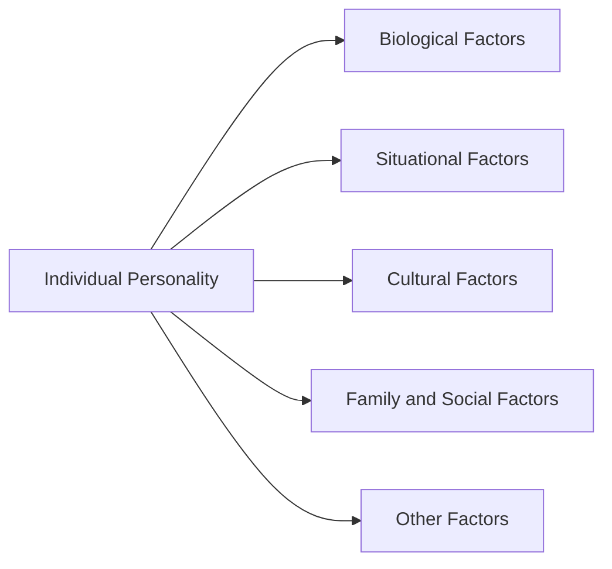
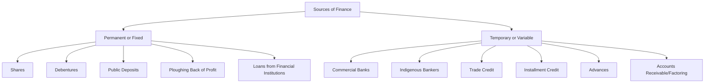

# ENTP CIE-II Questions & Answers

## 1. Define Analysis of market demand
[cite_start]Analysis of market demand involves a detailed study of various market segments in terms of customer preferences, competitors, untapped demand, and prevalent trade practices[cite: 2405]. [cite_start]It aims to identify the depth and breadth of demand, determine the flow of stock, and identify customer status and buying capacity[cite: 2408, 2413].

---

## 2. Define Feasibility of Study
[cite_start]Feasibility analysis (or feasibility study) is used to assess the strengths and weaknesses of a proposed project and present directions for activities that will improve the project and achieve desired results[cite: 1958]. [cite_start]It helps organizations determine if a project is doable, if it makes effective use of resources, and assesses the viability, cost, and benefits before financial allocation[cite: 1962, 1968].

---

## 3. List any two components of tax burden in a project
Two components of tax burden in a project include:
1.  [cite_start]**Direct Taxes:** Such as Income Tax and Corporate Tax[cite: 1602, 1603].
2.  [cite_start]**Indirect Taxes:** Such as GST on goods and inputs or Customs duty on imported machinery[cite: 1606, 1607].

---

## 4. List any Three Activities involved in construction phase.
Three activities involved in the project management construction phase are:
1.  [cite_start]**Site Preparation:** Clearing land, arranging utilities, and ensuring safety measures[cite: 1520].
2.  [cite_start]**Resource Mobilization:** Arranging materials, labour, equipment, and contractors[cite: 1521].
3.  [cite_start]**Scheduling Work:** Following time plans, milestones, and daily progress plans[cite: 1522].

---

## 5. Define Procrastination
[cite_start]Procrastination, in the context of time management weaknesses, refers to the delaying or postponing of activities, often resulting in "non-done" tasks or the failure to meet clear objectives[cite: 1358, 1368]. [cite_start]Effective time management helps minimize procrastination by creating action plans and focused task execution sequences[cite: 1358].

---

## 6. Explain Behavioral aspects of Entrepreneurial.
[cite_start]Entrepreneurial behavior is central to the organizational performance and is driven by a sense of self-discovery and independence[cite: 156]. Important behavioral aspects include:
* [cite_start]**Taking Responsibility:** Entrepreneurs choose their behavior and response to situations; feelings are a result of how they view a situation[cite: 158].
* [cite_start]**Psychology:** This involves cognition (awareness), affection (feeling), and conation (acting)[cite: 163, 164, 165].
* [cite_start]**Personality:** The unique, integrated system of behavior including physical traits, attitudes, and habits[cite: 168].
* [cite_start]**Interest and Attitude:** A preference for specific activities and a mental state of readiness organized through experience[cite: 171, 174].
* [cite_start]**Emotions:** The state of being stirred up; negative emotions can lead to non-cooperation[cite: 177, 178].

---

## 7. Define the Project Finance.
[cite_start]Project finance is the financing of long-term infrastructure and industrial projects based on a non-resource or limited resource financial structure[cite: 3018]. [cite_start]It is a loan structure that relies primarily on the project cash flow for repayments, with the project assets, rights, and interests held as security[cite: 3019].

---

## 8. What is market and demand Analysis.
[cite_start]Market and demand analysis helps the project manager understand how the firm's abilities can be synchronized with market requirements[cite: 2004]. [cite_start]Market analysis studies market needs and consumer preferences, while demand analysis aims at calculating the aggregated demand for a particular product or service[cite: 2005].

---

## 9. List any two components of tax burden
*Note: This is a duplicate of Question 3.*
Two components are:
1.  [cite_start]**Direct Taxes:** Taxes on income, property, or profits[cite: 1847].
2.  [cite_start]**Indirect Taxes:** Taxes on goods and services like sales tax or VAT[cite: 1848].

---

## 10. Define Resource Mobilization.
[cite_start]Resource mobilization involves arranging the necessary assets for project execution, including materials, labour, equipment, and contractors[cite: 1521]. [cite_start]It is a key activity in the construction phase to ensure the project plan is converted into physical reality[cite: 1517].

---

## 11. What is Personality Determinants?
[cite_start]Personality determinants are the factors that shape an individual's personality, including biological factors (heredity, brain, physical features) [cite: 268, 270][cite_start], situational factors (environment, knowledge, skill) [cite: 283][cite_start], cultural factors (beliefs, traditions) [cite: 290][cite_start], and family/social factors (socialization and identification processes)[cite: 292].

---

## 12. What are Change behaviors?
[cite_start]Change behavior refers to any transformation or modification of human behavior[cite: 13]. [cite_start]Theories cite environmental, personal, and behavioral characteristics as major factors[cite: 15]. [cite_start]Elements of change behavior include **Self-efficacy** (impression of one's own ability), **Learning Theories** (behavior learned through modification), and **Social Learning** (behavior determined by environmental and personal elements)[cite: 17, 21, 22].

---

## 13. Explain the Leadership style.
[cite_start]Leadership style refers to the different behaviors or actions that a leader exhibits in different positions to lead subordinates according to situations[cite: 71, 74]. The main types are:
* [cite_start]**Autocratic:** The leader makes unilateral decisions, centralizes authority, and uses coercive power[cite: 708, 709].
* [cite_start]**Democratic (Participative):** The leader involves the group in decision-making, delegates authority, and encourages participation[cite: 727].
* [cite_start]**Laissez-Faire (Free-rein):** The leader gives the group complete freedom, provides materials, and avoids giving feedback, relying on worker self-motivation[cite: 742, 748].

---

## 14. What do you mean by Technical Analysis?
[cite_start]Technical analysis is used by engineering experts to examine and formulate a project, assessing its technical feasibility[cite: 1926]. [cite_start]It covers aspects such as manufacturing processes/technology, technical arrangements, material inputs and utilities, product mix, plant capacity, location, and machinery requirements[cite: 1930].

---

## 15. Differentiate Technical analysis and market demand analysis.
[cite_start]**Technical Analysis** concerns project inputs (supplies) and outputs (production) of real goods and services, identifying gaps in information, selecting technology, and determining plant capacity and location[cite: 2306, 2311].
[cite_start]**Market Demand Analysis** focuses on identifying the depth and breadth of demand, customer preferences, competitors, and estimating the aggregated demand for the product to ensure effective demand at a remunerative price[cite: 2005, 2008, 2297].

---

## 16. What is market demand analysis.
*Note: This is a duplicate of Question 8.*
[cite_start]Market demand analysis involves the detailed study of market segments, customer preferences, and competitors to calculate the aggregated demand for a product[cite: 2005, 2405]. [cite_start]It ensures that the firm's abilities are synchronized with market requirements[cite: 2004].

---

## 17. Write about time management.
[cite_start]Time Management refers to managing time effectively so that the right time is allocated to the right activity and making the best use of limited time[cite: 1249, 1250]. [cite_start]Elements include effective planning (To-Do Lists), setting goals and objectives, setting deadlines, delegating responsibilities, prioritizing tasks (using ABC or matrix methods), and spending the right time on the right activity[cite: 1253, 1259, 1261, 1266, 1270].

---

## 18. What are motivation aspects.
[cite_start]Motivation is the inner state of mind that activates and directs behavior, or the willingness to exert efforts towards a goal[cite: 903, 904]. Aspects include:
* [cite_start]**Types:** Negative (fear/force), Positive (reward), Extrinsic (wages/benefits), Intrinsic (satisfaction/praise), Financial, and Non-Financial[cite: 915, 921, 922, 924].
* [cite_start]**Need Hierarchy:** Maslow's theory organizes needs from Physiological to Safety, Social, Ego, and Self-Actualization[cite: 1040].
* [cite_start]**Role:** Motivation leads to best resource utilization, willingness to contribute, reduction in labor problems, and increased productivity[cite: 1004, 1006, 1011].

---

## 19. What is technical analysis
*Note: This is a duplicate of Question 14.*
[cite_start]Technical analysis is the examination of a project by technical experts to formulate the project's technical requirements[cite: 1926]. [cite_start]It involves analyzing the manufacturing process, technical arrangements, material inputs, plant capacity, location, machinery, and environmental aspects[cite: 1930].

---

## 20. Differentiate technical analysis and market demand analysis.
*Note: This is a duplicate of Question 15.*
[cite_start]Technical analysis assesses the "how" of the project: technology, equipment, location, and inputs required to produce the goods[cite: 2306]. [cite_start]Market demand analysis assesses the "who" and "how much": identifying customers, market size, competition, and sales potential[cite: 2296, 2297].

---

## 21. What are the types of personality determinant?
The types of personality determinants are:
1.  [cite_start]**Biological Factors:** Heredity, Brain, and Physical features[cite: 268, 270].
2.  [cite_start]**Situational Factors:** The influence of the immediate environment and specific situations[cite: 283].
3.  [cite_start]**Cultural Factors:** Beliefs, values, and patterns of behavior shared by a culture[cite: 290].
4.  [cite_start]**Family and Social Factors:** The socialization and identification processes within a family and social group[cite: 292].

*Diagram Reference: Ent5.pdf, Page 12, Fig 5.2.2*

---

## 22. Explain the elements of project organization for successful implementation
For successful implementation, project organization requires:
1.  [cite_start]**Defining Project Structure:** Choosing between Functional, Matrix, or Projectized structures[cite: 1677].
2.  [cite_start]**Establishing Roles:** Clearly defining the Project Manager, Sponsor, Team Members, and Stakeholders[cite: 1681].
3.  [cite_start]**Accountability:** Using tools like the RACI Matrix to assign responsibility[cite: 1701].
4.  [cite_start]**Communication Framework:** Establishing protocols for meetings and reporting[cite: 1705].
5.  [cite_start]**Resource Allocation:** Identifying and distributing personnel and equipment[cite: 1711].
6.  [cite_start]**Risk Management:** Maintaining a risk register and mitigation plans[cite: 1724].

---

## 23. Explain the various determinants of personalities in detail.
Personality determinants are the factors that shape an individual's unique character.
* [cite_start]**Biological Factors:** These include **Heredity** (transmission of qualities like temperament and muscle power from ancestors) [cite: 271][cite_start], **Brain** (though complex, it plays a major stake in designing personality) [cite: 276][cite_start], and **Physical Features** (height, weight, appearance influence how one is perceived)[cite: 277].
* [cite_start]**Situational Factors:** The environment exercises constraints and provides push; knowledge and skill are acquired through interaction with the environment[cite: 283, 287]. A person may behave differently depending on the specific situation.
* **Cultural Factors:** Every culture has beliefs and patterns regarding independence, aggression, and cooperation. [cite_start]Individuals are expected to behave according to these cultural norms[cite: 290].
* [cite_start]**Family and Social Factors:** This involves the **Socialization Process** (acquiring acceptable behavior patterns from the family) [cite: 294] [cite_start]and the **Identification Process** (where a child tries to emulate parents or models)[cite: 297]. [cite_start]The home environment created by parents is critical to development[cite: 304].

*Diagram Reference: Ent5.pdf, Page 12, Fig 5.2.2*



---

## 24. Explain Financial analysis and list out necessary technical analysis.

**Financial Analysis:**
Financial analysis involves estimating project costs, operating costs, and fund requirements to assess the financial viability of the project. It helps in comparing proposals using tools like discounted cash flow, cost-volume-profit relationship, and ratio analysis. It includes preparing projected balance sheets, profitability estimates, and cash flow statements.

**Necessary Technical Analysis:**
The necessary aspects of technical analysis include:

1. Manufacturing process/technology.


2. Technical arrangements.


3. Material inputs and utilities.


4. Product mix.


5. Plant capacity (Feasible normal and Nominal maximum).


6. Location and site.


7. Machineries and equipments.


8. Structure and civil works.


9. Environmental aspects.


---

## 25. Explain Urgency time management matrix?

The Urgency Time Management Matrix (Eisenhower Matrix) categorizes activities based on their **Importance** and **Urgency** into four quadrants to help prioritize focus.

* **Quadrant 1 (Important and Urgent - Crises Mode):** Includes deadlines, emergencies, and pressing meetings. Spending too much time here leads to stress and burnout.


* **Quadrant 2 (Important but Not Urgent - Proactive Mode):** Includes strategic planning, relationship building, and training. This is the key to effective management, allowing for planning without pressure.


* **Quadrant 3 (Urgent but Not Important - Reactive Mode):** Includes interruptions, some emails, and meetings. These distract from vital tasks and should be reduced.


* **Quadrant 4 (Not Important and Not Urgent - Disengagement Mode):** Includes trivia, time wasters, and excessive TV. These provide no value and should be minimized.


*Diagram Reference: Ent5.pdf, Page 59, Fig 5.8.1*

---

## 26. Explain Project planning CPM techniques.

The **Critical Path Method (CPM)** is a deterministic project planning technique used when activity times are known and fixed. The steps involved are:

1. Identify activities and sequence them.
2. Draw a network diagram.
3. Estimate time for each activity.
4. Find earliest start and finish times.
5. Identify the **critical path**, which is the longest duration path through the network.
6. Determine project duration and control delays by focusing on critical activities .
CPM is useful in construction and manufacturing as it highlights slack/float time and helps in resource allocation.


---

## 27. Explain PERT Techniques in detail.

The **Program Evaluation and Review Technique (PERT)** is a probabilistic technique used when activity times are uncertain. It uses three time estimates for each task:

1. 
**Optimistic time (O):** The best-case scenario.


2. 
**Most likely time (M):** The normal duration.


3. 
**Pessimistic time (P):** The worst-case scenario.


The Expected Time () is calculated using the formula:


.
PERT is suitable for R&D and new product development as it helps in risk analysis and forecasting completion time where standard times are not available.

---

## 28. Explain Time management strengths and weaknesses in detail.

**Strengths (Advantages) of Time Management:**

* 
**More Tasks Completed:** Good planning allows for more output.


* 
**Flexibility:** Lists and priorities allow for adjustments.


* 
**No Event Missed:** Scheduling ensures deadlines and events are met.


* 
**Reduces Stress:** Reduces anxiety associated with complex tasks.


* 
**Minimizes Procrastination:** Helps create action plans to avoid delay.


* 
**Self-Confidence:** Improves performance and builds confidence.


**Weaknesses (Disadvantages) of Time Management:**

* 
**Non-clear Objectives:** Can lead to being stuck if goals aren't clear.


* 
**Mismanagement:** Excessive organizing can lead to fatigue or blunders if details are forgotten.


* 
**Can't Say "No":** Strict scheduling might make it hard to refuse others, leading to friction.


* 
**Obstacles:** Knowing exactly what to do can make one intolerant of idle time or disturbances.


* 
**Inactivity:** Obsession with doing things "right" can sometimes make life stagnant.


---

## 29. Describe in detail about attributes and models?

**Personality Attributes:**
Key attributes for an effective personality include **Attitude** (optimistic/positive), **Enthusiasm** (intense interest), **Ethical** (moral principles), **Goal Focused** (clarity on objectives), **Listener** (empathetic), **Persistent** (enduring adversity), and **Self-Confidence** (belief in abilities) .

**Personality Models:**

1. **Myers-Briggs Type Indicator (MBTI):** Based on Jung’s theories, it uses four dichotomies: Extraversion/Introversion, Sensing/Intuition, Thinking/Feeling, and Judging/Perceiving. These combine to form 16 personality types (e.g., ISTJ, ENFP) useful for career and relationship counseling.


2. 
**The Big Five Model:** Identifies five basic dimensions: **Extroversion** (sociable), **Emotional Stability** (calm vs. nervous), **Agreeableness** (cooperative), **Conscientiousness** (dependable/organized), and **Openness** (creative/curious) .


3. 
**Physiognomy:** Sheldon’s model based on body types: Endomorph (friendly/comfort-seeking), Mesomorph (aggressive/active), and Ectomorph (shy/intelligent) .


---

## 30. Discuss the project management during construction phase.

The construction phase deals with converting the project plan into physical reality. Effective management ensures timely completion, quality work, and cost control.
Key activities include:

* 
**Site Preparation:** Clearing land and arranging utilities.


* 
**Resource Mobilization:** Arranging materials, labour, and equipment.


* 
**Scheduling:** Monitoring detailed work plans and milestones (using Gantt/CPM).


* 
**Quality Control:** Testing materials and ensuring standards are met.


* 
**Cost Control:** Monitoring expenses and managing budgets to prevent overruns.


* 
**Risk & Safety Management:** Compliance with laws and managing hazards.
The objective is to complete the project within time, budget, and quality parameters while minimizing disputes.


---

## 31. What are strengths? Explain motivation aspects in details.

**Strengths:** In the context of behavioral aspects, strengths often refer to **Time Management strengths** (such as increased task completion, stress reduction, and goal achievement) or **Leadership strengths** (such as integrity, self-confidence, and emotional maturity).

**Motivation Aspects:**
Motivation is a process starting with a need that activates behavior aimed at a goal.

* 
**Nature:** It is the willingness to exert effort and is defined as an inner state that directs behavior.


* **Types of Motivation:**
* 
**Negative:** Based on fear or force (threats of demotion).


* 
**Positive:** Based on reward and possibility of gain.


* 
**Extrinsic:** External benefits like wages, insurance, and holidays.


* 
**Intrinsic:** Satisfaction from the work itself, recognition, and responsibility.


* 
**Financial/Non-Financial:** Monetary rewards vs. praise/delegation.


* 
**Techniques:** Include employee empowerment, learning opportunities, and innovation encouragement.


---

## 32. Explain in a detail about project organization.

Project organization refers to the structure and roles required to execute a project effectively.
**Types:**

1. **Functional Organization:** Based on departments (finance, marketing). It offers specialization but may have slow decision-making.


2. **Project (Pure) Organization:** The team works only for the project. It offers fast decisions and strong control but can be costly due to resource duplication.


3. **Matrix Organization:** A combination where members have dual reporting to functional and project managers. It offers flexibility but can cause conflict due to dual authority.


**Key Roles:** The structure includes the Project Manager (oversees lifecycle), Project Sponsor (funding/direction), Team Members (execution), and Stakeholders.

---

## 33. Interpret the Types of Project Financing

Project financing in India involves various sources available for raising funds, categorized into Permanent/Fixed and Temporary/Variable finance.

*Diagram Reference: Ent3.pdf, Page 40, Fig 3.4.1*



1. 
**Permanent/Fixed Finance:** Raised for a long period via Shares, Debentures, Public Deposits, Ploughing back profits, and Loans from institutions like IFCI, IDBI, ICICI.


2. 
**Temporary/Short-term Finance:** Raised for working capital via Commercial Banks, Trade Credit, Installment Credit, and Factoring.


---

## 34. Describe in detail about project planning and control using CPM and PERT techniques.

**Critical Path Method (CPM):**
CPM is a deterministic technique used when activity times are known and fixed. It involves identifying activities, drawing a network diagram, and calculating the critical path (longest duration path). It focuses on time-cost trade-offs and is widely used in construction and manufacturing. It helps identify "slack" or float time in non-critical tasks.

**Program Evaluation and Review Technique (PERT):**
PERT is a probabilistic technique used when activity durations are uncertain. It uses three time estimates (Optimistic, Most Likely, Pessimistic) to calculate an Expected Time (). It focuses on uncertainty and risk assessment, making it suitable for R&D projects.

**Comparison:**

* **Time Estimate:** CPM is Fixed/Single-point; PERT is Probabilistic/Three-point.


* **Focus:** CPM focuses on Time & Cost; PERT focuses on Time and Risk.


* **Use Area:** CPM for Construction; PERT for Research & Development.


Both methods are used to plan realistic timelines, schedule tasks (Gantt charts), monitor progress against milestones, and manage risks.

```
