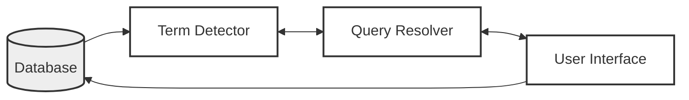

# Answers to Questions from Image

## Short Answer Questions

### 1. Clustering
[cite_start]Clustering is the process of grouping similar objects, such as terms or items, into a "class" or cluster under a more general title[cite: 704]. [cite_start]The primary goal of clustering in information systems is to assist in the location of information by organizing items in a textual database[cite: 3, 700].

### 2. Statement
[cite_start]In the context of Information Retrieval Systems, a search statement is a statement of an information need generated by users to specify the concepts they are trying to locate in items[cite: 485]. [cite_start]It represents the user's attempt to specify the conditions needed to logically subset the total item space to find the cluster of items containing the needed information[cite: 487, 491].

### 3. Information Search & Visualization
[cite_start]Information search (often called a "pull" system) involves a user proactively making a decision to query the system for information[cite: 651, 652]. [cite_start]In contrast, information visualization addresses how the results of a search are optimally displayed to the user to facilitate their understanding of the results and help them select the most likely items of interest[cite: 523, 524].

### 4. Techniques in S/W search algorithm
[cite_start]There are four major algorithms associated with software text search: the Brute Force approach, the Knuth-Morris-Pratt algorithm, the Boyer-Moore (Shift-OR) algorithm, and the Rabin-Karp algorithm [cite: 54-58]. [cite_start]Among these, Boyer-Moore is typically the fastest, requiring at most $O(n+m)$ comparisons[cite: 59].

### 5. Word Inversion
[cite_start]Word inversion is one of the three classical text retrieval techniques defined for organizing items in a textual database, alongside full text scanning and multi-attribute retrieval [cite: 3-7]. It typically involves creating an index structure (like an inverted index) that maps words to their locations in documents, allowing for rapid identification of items without scanning the full text.

### 6. Binding
[cite_start]Binding refers to the process where a more abstract form of a search is redefined into a more specific form[cite: 490]. [cite_start]This occurs at multiple levels: binding to the user's vocabulary and experience, binding when the search statement is parsed for a specific system, and the final binding when the search is applied to a specific database[cite: 489, 493, 494].

### 7. Dissemination
[cite_start]Selective Dissemination of Information (SDI) systems, often called "push" systems, differ from standard search systems because the user does not actively query for each need [cite: 649-651]. [cite_start]Instead, the user defines a profile (similar to a stored query), and as new information is added to the system, it is automatically compared to the user's profile to alert them of relevant content[cite: 653].

### 8. Proximity
[cite_start]In the context of visualization (Gestalt principles), proximity suggests that figures that are nearby are grouped together perceptually[cite: 535, 537]. [cite_start]In the context of text search, proximity refers to the logic that determines if search terms are found within a specific distance of each other in the text, which is a function supported by hardware searchers like the Fast Data Finder[cite: 341].

### 9. Fast Data Finder
[cite_start]The Fast Data Finder (FDF) is a specialized hardware text search unit that consists of an array of programmable text processing cells connected in series to form a pipeline hardware search processor[cite: 312, 314]. [cite_start]Each cell acts as a comparator for a single character, and data passes through the pipeline to be analyzed, allowing for functions like Boolean logic, proximity, and fuzzy matching[cite: 316, 318, 340].

*(See diagram below based on Page 12 of "5th unit merged.pdf")*


### 10. Full Text Scanning

Full text scanning, also known as streaming, is a technique where the text to be searched is read into memory or passed through a detector and compared directly to the query terms. The basic concept is that users enter queries, and the system accesses the full text to detect the existence of search terms, outputting detected terms to a query resolver for logical processing.

*(See diagram below based on Page 1 of "5th unit merged.pdf")*



---

## Long Answer Questions

### 1. Characteristics of Intelligent Agents

Intelligent Agents are active processes that traverse information sites (like the Internet) to locate text for indexing or retrieval. There are six key characteristics that define them:

1. 
**Autonomy:** The agent must operate without human interaction, having control over its internal states and making independent decisions to traverse sites.


2. 
**Communications Ability:** The agent must be able to communicate with information sites using a universally accepted language (e.g., Z39.50).


3. 
**Capacity for Cooperation:** Agents should be able to cooperate to perform mutually beneficial tasks.


4. 
**Capacity for Reasoning:** Agents use reasoning scenarios such as Rule-based (defined conditions), Knowledge-based (using stored previous conditions), or Artificial evolution-based logic.


5. 
**Adaptive Behavior:** Closely tied to autonomy and reasoning, this permits the agent to assess its current state and decide on future actions.


6. 
**Trustworthiness:** The user must trust that the agent will act on their behalf to locate relevant information they have access to.


### 2. Manual Clustering

Manual clustering, often discussed in the context of thesaurus generation, involves the grouping of similar objects or terms into classes based on human judgment rather than automated statistical algorithms. The process begins by defining the domain to identify objects (e.g., Medicine, Education) and determining the attributes of these objects. A critical step is determining the strength of relationships between attributes to suggest which objects belong in the same class.

When creating these classes manually, specific rules are followed: a well-defined semantic definition must exist for each class, the size of classes should be managed (kept small), and one object should not dominate the class . For example, putting a very frequent term like "microprocessor" in a class with rare terms might introduce errors, so it might require its own class . Additionally, decisions must be made regarding word coordination (phrases vs. terms), word relationships (equivalence, hierarchical), and homograph resolution .

### 3. Ranking Algorithm

Ranking algorithms are essential in modern information systems to order the output from the most likely relevant items to the least likely, thereby reducing the user's overhead in finding desired information . Unlike early Boolean systems that ordered results by date, ranking uses similarity measures to calculate a value representing the closeness of an item to a query.

A common method involves the Vector Space Model, where both the document and the query are treated as vectors. The similarity is often calculated using the Cosine formula, which measures the angle between the two vectors; a value close to 1 indicates high similarity. Other approaches include probabilistic models, such as those using Bayesian statistics or Hidden Markov Models, which estimate the probability that a document is relevant given a specific query . By presenting the most relevant items first, the system improves the efficiency of the user's search experience.

### 4. Aspects of Visualization

The visualization process in information systems relies on cognitive engineering and the neural processes of the human visual system, such as preattention. Preattention allows the brain to quickly form primitives and detect significant visual information, such as boundaries between different orientations or shapes, without conscious effort . For instance, users can rapidly detect the border between different texture patterns (as shown in Figure 8.1 of the text).

Visualization also involves the use of color to organize, classify, and enhance features. The goals of displaying search results generally fall into two categories: document clustering and search statement analysis. Document clustering attempts to visually represent the document space and clusters within it to help users navigate to items of interest . Search statement analysis helps users understand why items were retrieved by displaying terms and their importance, allowing for query refinement.

### 5. Boyer-Moore Algorithm

The Boyer-Moore algorithm is considered one of the fastest string searching algorithms, requiring at most O(n+m) comparisons. Unlike the Brute Force approach, it skips characters to increase speed. The algorithm works by constructing a 'Bad Match Table' based on the pattern being searched.

The comparison process starts from the rightmost character of the pattern against the given string. If a mismatch occurs, the algorithm shifts the pattern to the right based on the value found in the 'Bad Match Table' corresponding to the mismatched character. The value for the shift is calculated as `value = length of pattern - index - 1`, with the last value equal to the length of the pattern if not defined elsewhere. This allows the algorithm to jump over sections of text that cannot possibly match, significantly reducing the number of comparisons needed.

### 6. Measures Used in Information System

Evaluating information systems involves both efficiency and effectiveness measures. Efficiency is often measured by response time, defined as the time it takes to execute a search. Effectiveness is typically measured using Precision, Recall, and Fallout.

* 
**Precision** is the ratio of relevant items retrieved to the total number of items retrieved.


* 
**Recall** is the ratio of relevant items retrieved to the total number of possible relevant items in the database.


* 
**Fallout** is the ratio of non-relevant items retrieved to the total number of non-relevant items.


Another advanced measure is **Unique Relevance Recall (URR)**, which is used to compare two or more algorithms. It measures the number of relevant items retrieved by one algorithm that are not retrieved by others, providing insight into the unique contribution of a specific search technique .

### 7. Markov Model

Hidden Markov Models (HMMs) introduce a new paradigm for text search where documents are not just static objects but are considered unknown statistical processes. In this model, a document is viewed as a process that can generate an output equivalent to the set of queries that would define it as relevant.

The concept relies on the "noisy channel" model: the author's ideas (the "keys" or relevant documents) are transmitted through a noisy channel (the mismatch between expression and query specification) resulting in the observed output (the user's query) . The goal is to compute the probability that a document D is relevant (R) given a query Q, denoted as P(D \text{ is } R | Q). Using Bayes' rule, this is derived from the probability of the query being produced by the document P(Q | D \text{ is } R) and the prior probability of the document being relevant.

### 8. Similarity Measures of Ranking

Similarity measures are used to calculate the similarity between an item and a search statement, with the value increasing as items become more similar. A fundamental approach is the vector space model, where terms are weighted and items are represented as vectors.

The simple sum of products formula can be used:


However, this requires normalization for item length. A more robust measure is the **Cosine Similarity formula**, which calculates the cosine of the angle between the document vector and the query vector.


As the Cosine value approaches 1, the vectors are coincident (highly similar); if it is 0, they are orthogonal (unrelated).

```

